# Smart Compiler Infrastructure

This project introduces an agentic approach for high-level and multi-purpose compilers.


## License

[](https://opensource.org/license/BSD-3-clause)

## References

- To deploy a LLM using ollama first we need to install Ollama by following 
its [Official Documentation](https://ollama.com)

## Acknowledgements

- National Science Foundation (NSF) funded AI institute for Intelligent Cyberinfrastructure with Computational Learning in the Environment (ICICLE) (OAC 2112606)

---

# Explanation

The core vision is to integrate a suite of expert-level compiler tools, enabling seamless, intelligent code analysis, optimization, and profiling for diverse programming languages.

## Smart Compiler Architectural Diagram

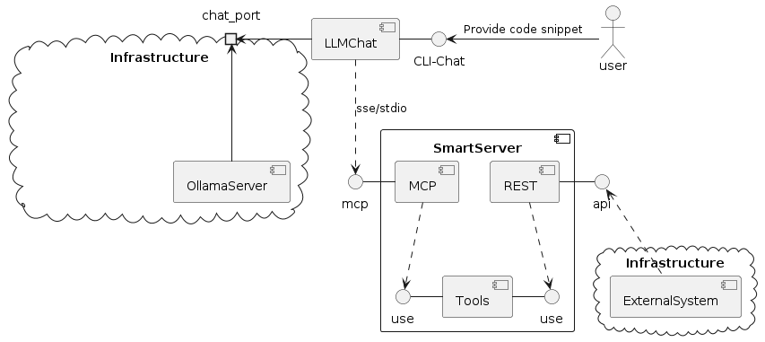

## IMT Integration

Details about the Smart Compiler as an Integration with the IMT (ICICLE Middleware and Tools) project can be found on the following diagramas:
### **Diagrams**:  
- [Diagram 1](https://drive.google.com/file/d/1S5gRxw_vizR1XnmbiZnAH1yZnkB8Ep0_/view?usp=drive_link)  
- [Diagram 2](https://drive.google.com/file/d/1tgCcINlzBUe6A1PCNX6R_ftAnb9WidcA/view?usp=sharing)


---


# How-To Guides

## Install the project
For dependency management and installation, this project uses ```uv```.
See [Astral Documentation](https://docs.astral.sh/uv) for installing the uv package manager.


## Project dependencies

### Create a virtual environment

In order to make a safe installation on the system, it is suggested to create a virtual envionment and install all the packages in this VE.
Let's create a virtual environment called SmartCompiler.
`python -m venv SmartCompiler`

Now, let's initiallize the virtual environment.
`source SmartCompiler/bin/activate`


### Packages
After installing **uv** run: ```uv sync``` for syncing project dependencies. 


If you do not want to use `uv` for dependencies maangement, you can install dependencies from the **requirements.txt** file. 
You can run `pip install -r requirements.txt` 

### Ollama
To deploy a LLM using ollama first we need to install Ollama by following 
its [Official Documentation](https://ollama.com).

Once Ollama is installed deploy the Ollama server (if it was not deployed by the installation).


### Quick Ollama deploy
1. Serve the Ollama server: ```ollama serve``` (if it is not already deployed).
2. Create LLM model using the SmartCompiler Modelfile: ```ollama create llama3.1-smart-compiler -f ollama-smart-compiler-Modelfile```.
3. Run the created LLM: ```ollama run llama3.1-smart-compiler:latest```.
4. If it opens a chat after running the LLM, just type ```/bye``` to close that chat.

#### Useful notes
##### To extract a Modelfile with ollama

```ollama show --modelfile llama3.1 > Modelfile```

###### To create from Modelfile with ollama

```ollama create llama3.1-tool -f Modelfile```


#### Setting up Environment variables
Set up the environment variables in a ```.env``` file.
An example of how this file looks like.
```
# For client, see envs/.client.example.env
# .env
LOG_LEVEL=INFO
OLLAMA_MODEL=llama3.1-smart-compiler:latest
OLLAMA_HOST=http://localhost:11434
MCP_SERVER_URL=http://localhost:8000/sse
ALLOWED_PATHS="/mnt/d/workspace/python/smart-compiler/examples"
```
In order to activate these client environment varibles , we must type :

`set -o allexport; source .env; set +o allexport`


```
For Server, see envs/.server.example.env
LOG_LEVEL=INFO
OLLAMA_MODEL=llama3.1:latest
OLLAMA_HOST=http://localhost:11434
MCP_SERVER_HOST=0.0.0.0
MCP_SERVER_PORT=8000
MCP_SERVER_TRANSPORT=sse
ENABLE_REST_API=true
ALLOWED_PATHS="/mnt/d/workspace/python/smart-compiler/examples"

```
In order to activate these server environment varibles , we must type :

`set -o allexport; source .env; set +o allexport`

we can aslo do it with: export $(cat .env | xargs) on Linux to load the env variables or just source in Windows


## Running the project
For running the project, once all dependencies and configurations are set, run the following command:

### SERVER

Run the server

```bash
python src/run_server.py

```

### CLIENT
Run the client.

Note: This client is a simple version that extends Llama model for using tools. Since the client is not robust enough, we encourage you using other more robust tools such as Claude desktop, Copilot or ChatGPT with MCP tools.

Smart compiler client is a PoC.

```bash
python src/run_client.py

```

Then the smart compiler will ask the user to provide the folder of the project that the user will be working on. Please provide a path example : /home/directory/projectAI

Then the smart compiler will ask which specific file will the smart compiler work on: type the name fo the file, exmaple : api_server.py

Then the smart compiler will ask which specific task to do: Profile or Optimize. Type what you would like to do with the program.


## Option A: Running from a single container
### Building image.
Build the smart compiler server, client and Ollama by running the script:
```bash
docker compose up -d --build
```

### Start an interactive sesion.
```bash
docker attach smart_client
```

Start playing with the Smart Compiler!


## Option B: Running from a two different containers

### Building images.

Build the smart compiler server and client by running the scripts:

```bash
docker build -f Server_dockerfile -t smart_server . #For SERVER
docker build -f Client_dockerfile -t smart_client . #For Client
```

**Note:** By default, the dockerfiles are configured for localhost deploy. If you are planning to deploy it in a distributed architecture, you need to make sure on setting up the proper env variables inside the dockerfiles.

### Running containers
For running the smart server you can run the following script.
```bash
docker run -d --name smart_server -p 8000:8000 smart_server #Server
docker run -it --name smart_client -p 8001:8001 smart_client #Client. Remember -it

```


# Tutorials
The Smart Compiler leverages AI models alongside traditional compiler techniques to boost the performance and scalability of C and Python programs. Through intelligent profiling and optimization strategies, it identifies and applies enhancements to improve code efficiency.

## Getting Started as an MCP Tool with COpilot or Cursor or Claude Desktop

This section guides you through setting up and using the Smart Compiler as an MCP (Model Context Protocol) tool alongside Cursor or Claude Desktop for code profiling and optimization.

### Copilot
(In case the env varibales are not enabled and the client and the server are not deployed)
First, we need to enable the environment variables for both, the Server and the client. See previous sections .

Now, we must deploy the server

```bash
python src/run_server.py

```

Once the servwer is deployed, let's deploy the Client

```bash
python src/run_client.py

```

Once the client and the server are deployed, we must go to VScode and type "control + shift + P " and search for " MCP: add Server"

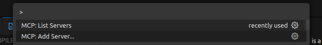

Then we choose HTTP:

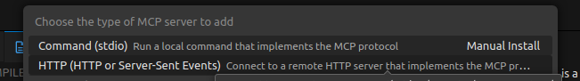

and then we add our Smart Compiler CLient deployed address: 

```bash
http://localhost:8000/sse
```

Now, we open a chat in COpilot and we set "Agent" instead of "Ask"

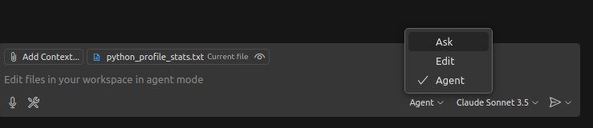

Now, we can start our first use case: 

Create a python code snippet that do some matrix multiplication and profile it

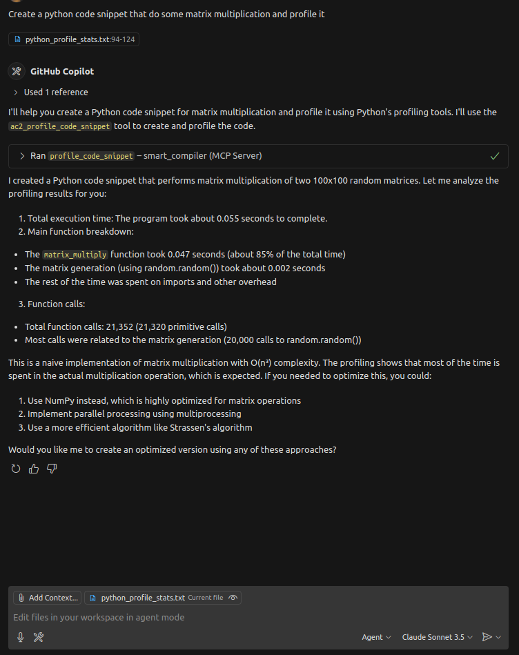

The code snippet and the profiling information will be stored in the following path:

/home/miguel/Desktop/Smart-COmpiler/SMART-COMPILER/tmp/.


### CORSE AND CLAUDE CONFIGURATION

### Server Setup
Configure the required environment variables in a local `.env` file, such as `.local.server.env`, to enable the MCP server.

```bash
#.local.server.env
LOG_LEVEL=INFO
OLLAMA_MODEL=llama3.1:latest
OLLAMA_HOST=http://localhost:11434  # Adjust to your model's hosting address
MCP_SERVER_HOST=0.0.0.0 #used for both, rest api and mcp servers
MCP_SERVER_PORT=8000 #for mcp and rest
MCP_SERVER_TRANSPORT=stdio
ENABLE_REST_API=false
ALLOWED_PATHS="/path/to/smart-compiler/examples"  # Specify the accessible directory
```

### Configuring Cursor
For Cursor, update the configuration to connect to the MCP server.

```json
{
  "mcpServers": {
    "smart_compiler": {
      "url": "http://localhost:8000/sse",
      "env": {}
    }
  }
}
```

### Configuring Claude Desktop
For Claude Desktop, configure the command and environment settings to run the MCP server.

```json
{
  "mcpServers": {
    "smart_compiler": {
      "command": "uv",
      "args": [
        "--directory",
        "/path/to/smart-compiler",
        "run",
        "src/run_server.py"
      ],
      "env": {
        "UV_PROJECT_ENVIRONMENT": "/path/to/smart-compiler",
        "UV_ENV_FILE": "/path/to/smart-compiler/envs/.local.mcp_server.env"
      }
    }
  }
}
```

### Verifying Server Deployment
Ensure the MCP server is running correctly by checking its connectivity.Refer to the example profiling request screenshot in the documentation:
<div>
    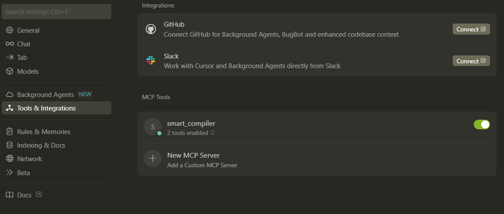
</div>

### Generating Code Snippets
Using Cursor to generate a code snippet for analysis.  
<br>
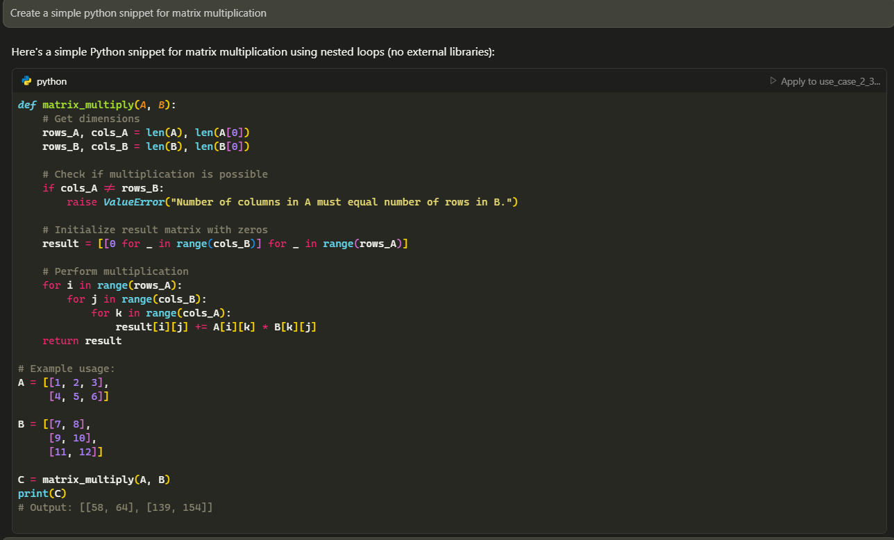

### Profiling Code
Request the Smart Compiler to profile your code via the MCP client. An example of tool usage is shown in the documentation.

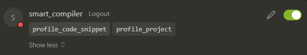

### Advanced Usage
Experiment with larger datasets and more complex interactions, as demonstrated in the documentation screenshots:

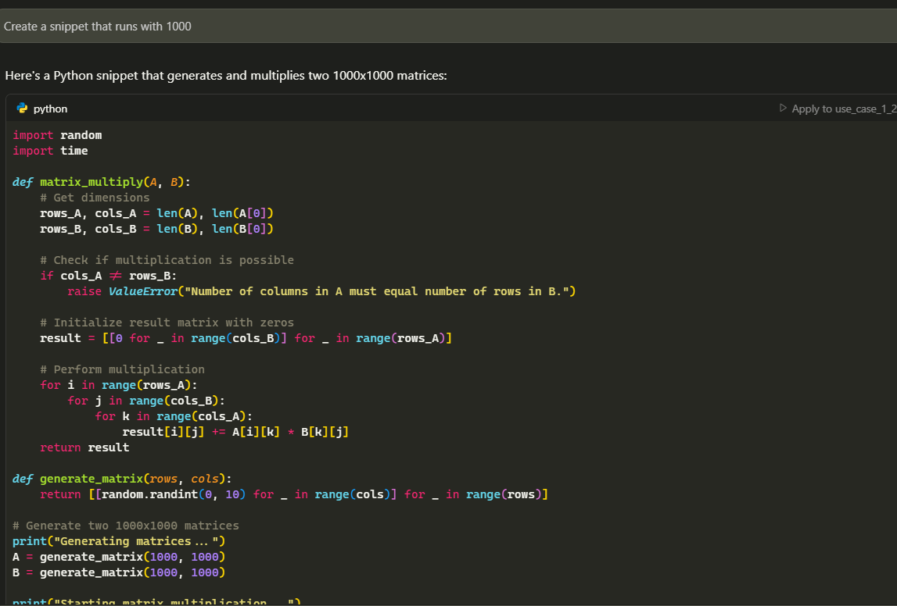
<br>
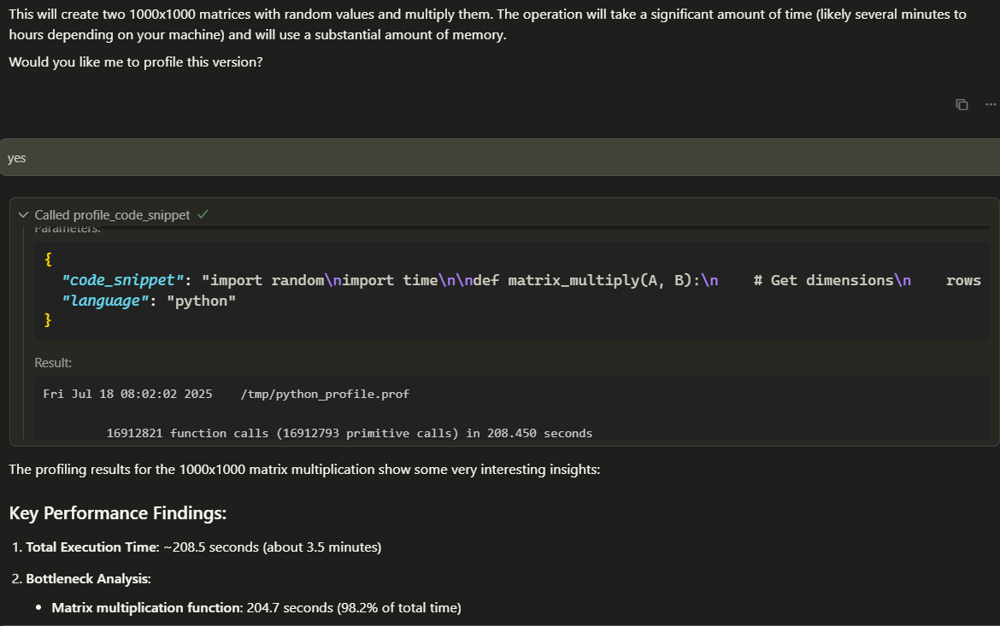
<br>
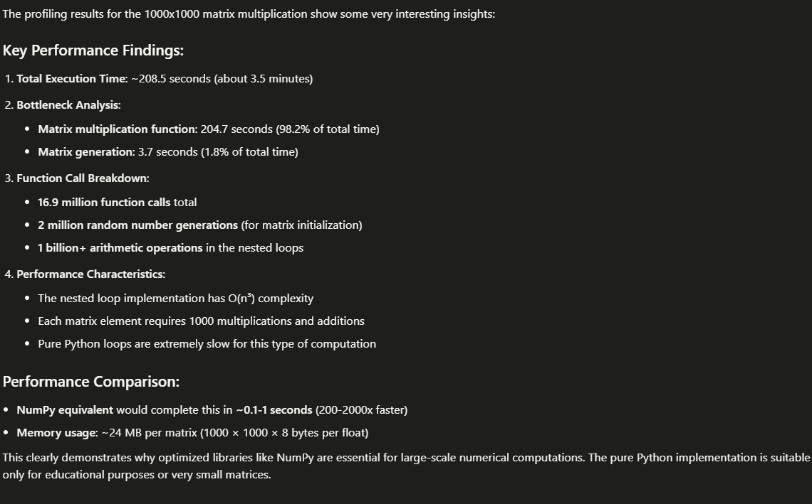
<br>

For a complete example, review the chat history in [Cursor + SmartCompiler example](docs/cursor_simple_python_snippet_for_matrix.md)

**Summary**: This section covers setting up the Smart Compiler as an MCP tool, configuring environment variables, connecting with Cursor or Claude Desktop, verifying server deployment, generating code snippets, profiling code, and exploring advanced use cases with larger datasets.

## Using Smart Compiler as a REST Service

This section explains how to deploy the Smart Compiler as part of monitoring environment by enabling its REST API for compiler tasks.

### Environment Setup for REST API
Configure the environment variables in `local.server.env` and enable the REST API.

```bash
LOG_LEVEL=INFO
OLLAMA_MODEL=llama3.1:latest
OLLAMA_HOST=http://localhost:11434  # Adjust to your model's hosting address
MCP_SERVER_HOST=0.0.0.0 #used for mcp and rest servers
MCP_SERVER_PORT=8000
MCP_SERVER_TRANSPORT=stdio
ENABLE_REST_API=true  # Enable REST API
ALLOWED_PATHS="/path/to/smart-compiler/examples"  # Specify the accessible directory
```

### Accessing API Documentation
Once the server is deployed, access the API documentation at `http://localhost:8000/docs`. For Postman collections, refer to the Smart Compiler GitHub repository.

### Scheduling a Profiling Task - IMT integration
Schedule a profiling task to analyze a code snippet, such as the provided [example](examples/matrix-multiplication/main.py)

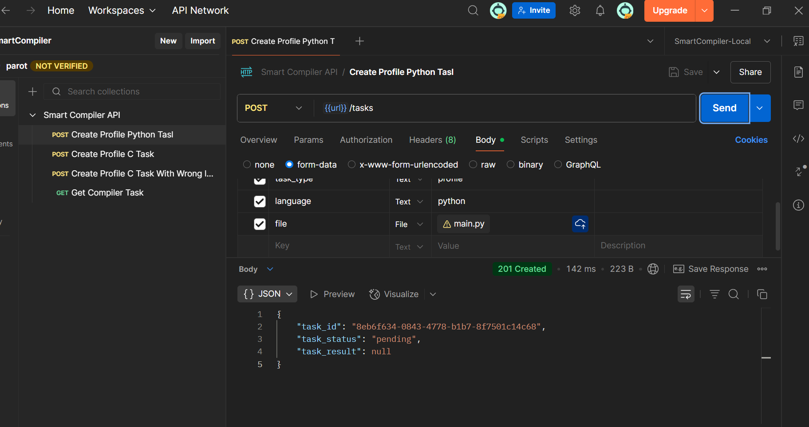

### Checking Task Status
Monitor the status of a scheduled profiling task, as shown in the screenshot.

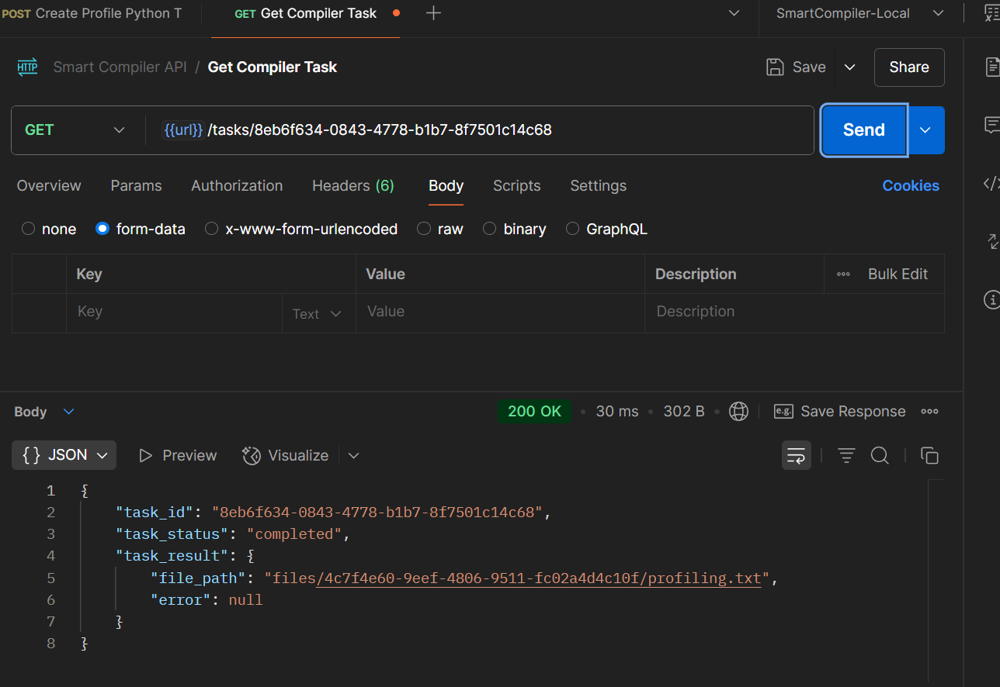

### Retrieving Profiling Results
Access profiling results via the API: 

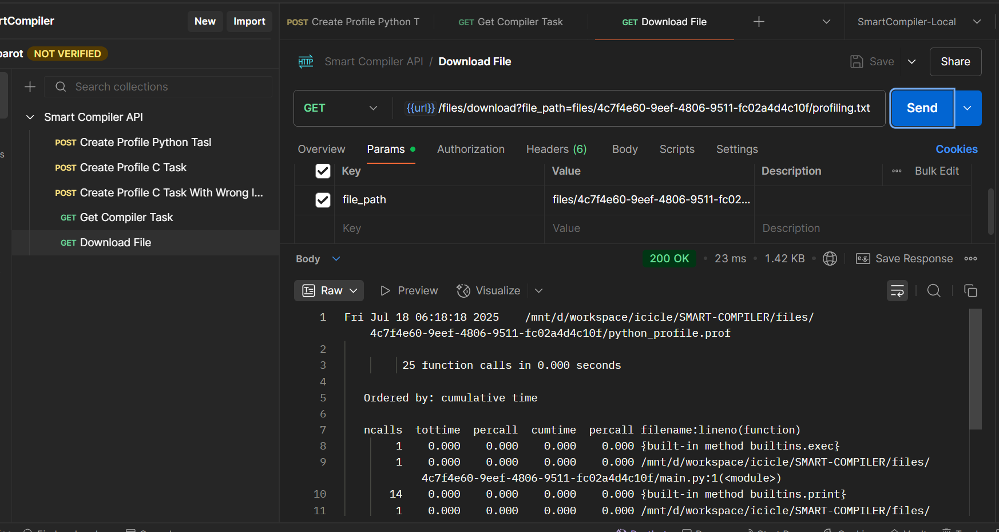

### Scheduling an Optimization Task
*Note*: Optimization task scheduling is currently in development and not yet available.


### Client Setup

Check `envs` folder to see examples for environment configuration. 

```bash
LOG_LEVEL=INFO
OLLAMA_MODEL=llama3.1-smart-compiler:latest #A LLM that support tools is required
OLLAMA_HOST=http://localhost:11434
MCP_SERVER_URL=http://localhost:8000/sse
ALLOWED_PATHS="/mnt/d/workspace/python/smart-compiler/examples"
```

Then, you can run the following command to initialize the Smart Compiler. 
```bash
python run src/run_client.py
#or
uv run src/run_client.py
```

Note: The client implemented in the SmartCompiler project is a PoC of a client. The “client” inside the SmartCompiler project is not a full production-ready client, but rather a minimal or experimental implementation. Its purpose is to demonstrate feasibility—showing that a client can connect, interact, and work with the SmartCompiler system. For more advanced uses, we recommend trying it out with platforms focused on MCP tools such as Cursor, Claude Desktop or Github Copilot as explain in previous sections.

--- 
